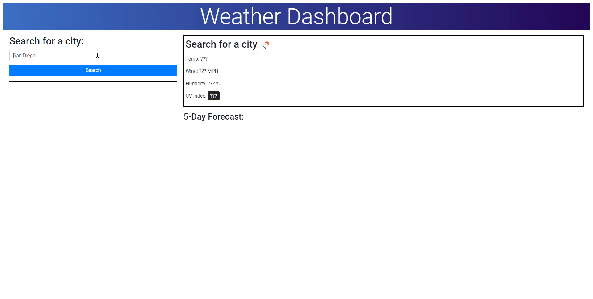

# Challenge 6: Weather Dashboard
This website is a small weather dashboard made in HTML and Javascript. 
This website uses both Bootstrap and jQuery for its primary functionality.

Features:
- Search history stored in localStorage for data persistence.
- 5 day forcasting in addition to current weather conditions.

UV index coloring and values are based on information from: https://www.epa.gov/sites/default/files/documents/uviguide.pdf

Live URL: https://stratiz.github.io/challenge-6-weather-dashboard/

